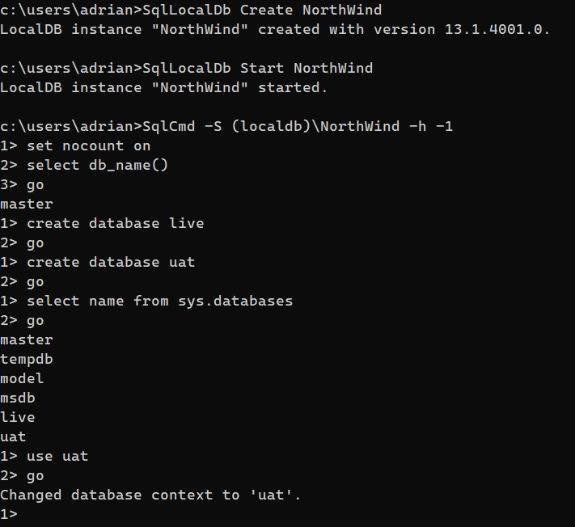

:toc:
:sectnums:
:toclevels: 5
:sectnumlevels: 5
:showcomments:
:xrefstyle: short
:icons: font
:source-highlighter: coderay
:tick: &#x2714;
:pound: &#xA3;

= Accessing Sql Server from C#

== Building a connection string

Connection strings can be built using `SqlConnectionStringBuilder`

[source,c#]
----
var builder = new SqlConnectionStringBuilder
{
    DataSource = server,
    InitialCatalog = dbName,
    IntegratedSecurity = true
};
----

The server (`DataSource`) is typically a hostname followed by a comma, followed by a port - e.g. `testdbinstance,10501`. `dbname` is typically an alphabetic string.

== localdb

For experiments, it is useful to create a local Sql Server instance and on or more databases on your local desktop/laptop rather than connecting to a remote server. To do this, simply use `(localdb)\instanceName` as the `DataSource` in `SqlConnectionStringBuilder`.

However, in order to do this:

* you must have an installed instance of SqlServer (or perhaps, if you are lucky, the local DB tools come with Visual Studio 2017/2019).
* You must create and initialise the local database instance with the `SqlLocalDb.exe` command:
** SqlLocalDb Create NorthWind
** SqlLocalDb Start NorthWind
+
You should then be able to run the `SqlCmd.exe` command to examine the instance and create datbases within it.

== Connection string format

SqlServer connection strings can be built using `SqlConnectionStringBuilder` or they can be specified directly as a string. For example, to connection to the server called `Squonk` on port 10501 and use database `Live1` with integrated security, we can use the following string.

[source,c#]
----
string conString = "Data Source=Squonk,10501;Initial Catalog=Live1;Integrated Security=True"
----

== Connecting to the database

To connect, we use `SqlConnection` (we need `using System.Data.SqlClient;`). We can then create a command to run on the database (for example a query). Sample code that returns a table as a `List` of rows with each row containing a `List` of columns is as follows:

[source,c#]
----
public static List<List<object>> GetResults(string server, string dbName, string sql, SqlParameter[] sqlParams)
{
    var builder = new SqlConnectionStringBuilder
    {
        DataSource = server,
        InitialCatalog = dbName,
        IntegratedSecurity = true
    };

    var list = new List<List<object>>();
    using (var connection = new SqlConnection(builder.ToString()))
    using (var command = new SqlCommand(sql, connection))
    {
        connection.Open();
        command.Parameters.AddRange(sqlParams);
        using (var reader = command.ExecuteReader())
        {
            while (reader.Read())
            {
                var innerList = new List<object>();
                list.Add(innerList);

                for (int i = 0; i < reader.FieldCount; i++)
                {
                    innerList.Add(reader[i]);
                }
            }
        }
    }
    return list;
}

----

== Running some SQL and returning a Datatable
